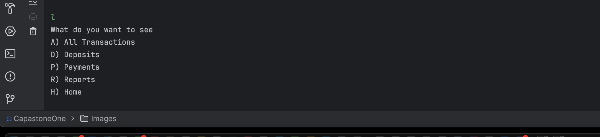

# Account Ledger Application
## Description
This is a simple CLI based Java code that allows a user to read and write their transaction histories with a embedded filtering and sorting methods to ease the search up.
## How To SetUp
- clone the repository from https://github.com/Phannul/capstone-1.git and run the main class.
## Features 
- Records deposit and payment transactions into a csv file
- Reads Added deposits and credited payments from a csv file
- Sorts all the transactions in descending order
- Adds filters into the desired transaction types and displays them accordingly
- Generates various types of reports, those include:
  - Month to Date
  - Previous Month
  - Year to Date
  - previous Year
  - search by vendor
## Technologies Used
- Language : Java
- Developer kit: JDK 17
- Build System : Maven 
- Classes: Main.java and Transaction.java
- Storage File: csv
- Code Space: InteliJ 
- 
## How to use
- when you run the code you will have this main menu screen 

- upon entering D into the console it will lead to the below screen

- After you enter the date in iso format (yyyy-MM-dd) it will prompt you to enter:
    - time also in iso fromat (HH:mm:ss)
    - description
    - vendor
    - amount
    - this will add the transaction into the csv file

**Note: option payment also does the same thing but saves the amount as a Negative**
- The ledger option lets you read the wirtten transactions in the csv file by offering 
different filters to choose from, filters on which transaction to print into the console

- The Reports subsection in the ledger menu offers deeper filters to print the desired transactions and also allows users to search a transaction using the vendors name
  
## Interesting Code Snippet

- this sorts the transaction lists in descending order in the conole
## Author
**Fanuel Birhane**
Sectioin 3 , Software Pathway
YUU Dallas,Texas
Email- fbirhane@my.yearupunited.org